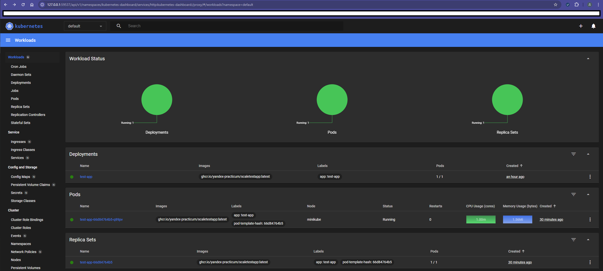
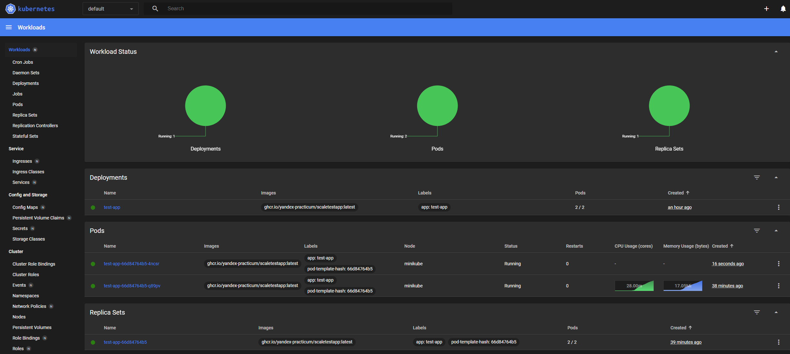
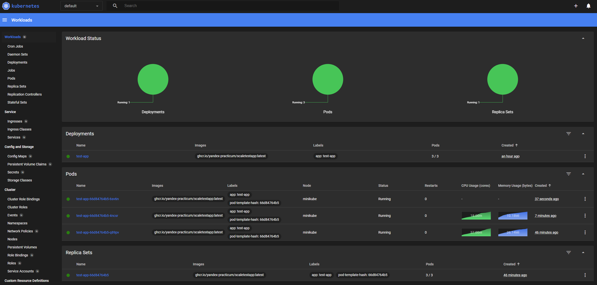
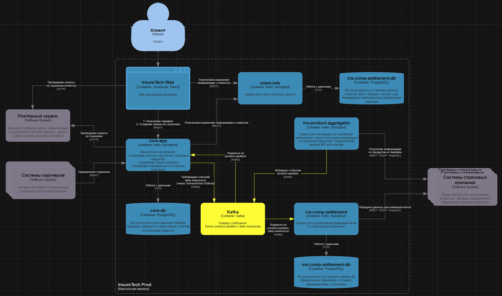
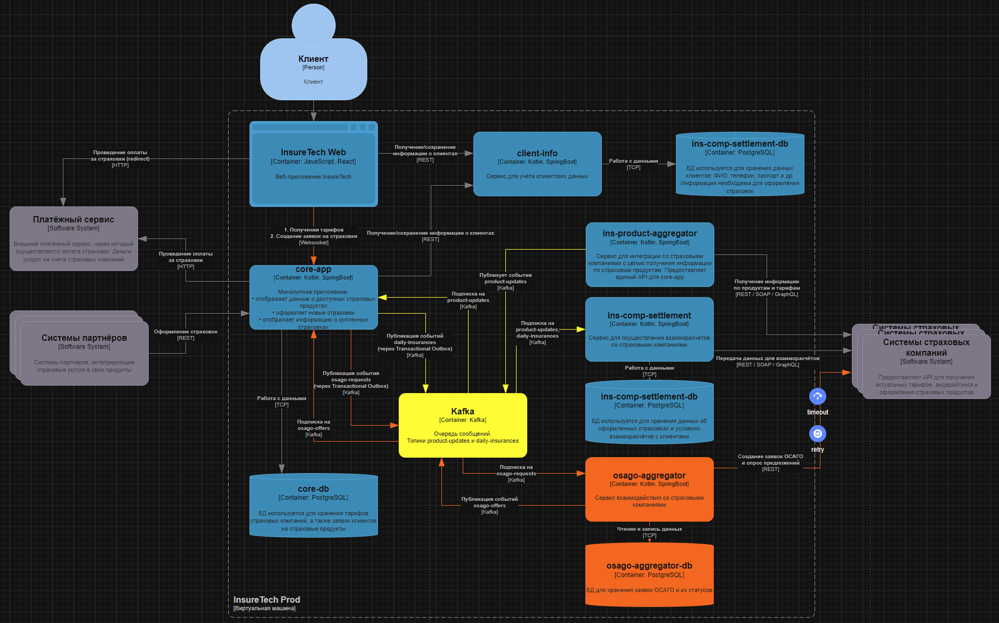

## Task 1

Т.к. планируется серьёзное увеличение нагрузки, рассматриваем горизонтальное масштабирование, вертикальное может помочь только в текущем моменте. Из-за высоких требований по отказоустойчивости будем использовать минимум 2 зоны доступности, чтобы обеспечить доступность в 99,9%. По этой же причине используем фейловер стратегию active-active - да, дороже, но на стоимость ограничений не было дано, а на время ограничения достаточно жёсткие. Так как сервис предполагается геораспределенным, ЦОДы скорее всего будут располагаться в разных странах (или континентах), поэтому используем независимые кластеры Kubernetes.
Доступность и администрирование репликации БД будем делать через локально развернутые на нодах Patroni, которые будут синхронизировать статусы через etcd по принципу консенсуса. HAProxy опрашивает через healthcheck Patroni, Patroni в случае, если БД жива и не меняла статус мастера или реплики возвращает 200. Сама БД состоит из мастера и 2-х реплик: запросы на запись идут в мастер, запросы на чтение идут в две реплики. Дальше при наблюдении за нагрузкой можено будет сделать вывод, что важнее - добавить ещё 2 реплики или продумывать шардирование.

## Task 2

Начальная конфигурация

Дал нагрузку в 100к человек. Через некоторое время поднялся 2 под после пересечения 80%

И ещё через некоторое время третий (после пересечения 32Mi)

## Task 3

### Проблемы текущей реализации
ins-product-aggregator запрашивает синхронно запрашивает данные у страховых компаний. После получения информации ещё и агрегирует полученную информацию. Сейчас и core-app, и ins-comp-settlement вызывают ins-product-aggregator синхронно. Это значит, что в случае затягивания с ответом одной из внешних страховых компаний, или при проблемах с агрегацией или просто долгим выполнением вызовы завершатся с ошибкой.

ins-comp-settlement - с учетом того, что обработка идет один раз и ночью, значит, скорее всего собирается общая аналитика. Она как правило не требует немедленного ответа, поэтому такие запросы точно можно переводить в асинхрон.

core-app - изначально запрашивает раз в 15 минут, поэтому асинхрон подходит, сам опрос через крон перекладываем на ins-product-aggregator, после сбора и агрегации всех данных складывает в очередь, больше нет зависимости от сетевых проблем, задержек с обработкой и т.д.
Помимо получения данных, core-app при оформлении страховки также будет записывать очередь с применением Transactional Outbox. core-app записывает данные в свою основную таблицу и в той же транзакции записывает событие в таблицу. Отдельный процесс читает записи из outbox-таблицы и публикует их в Kafka.

### Итоговая конфигурация

## Task 4

Почему для osago-aggregator создаем своё хранилище:
- Хранение заявок на ОСАГО и их статусов - создана, отправлена в СК, получен ответ.
- Повышение отказоустойчивости
Таким образом, даже в случае падения сервиса можено будет в любой момент времени продолжить обработки заявок, исключая дублирования по созданию новых заказов

В качестве API продолжаем использовать Kafka - и не нужны новые сервисы, и отлично справится как высоконагруженный инструмент.

Интеграция между InsureTech Web и core-app изменена с REST на WebSocket - теперь клиенту отображаются новые предложения по мере получения данных от страховых компаний.

При вызове страховых API из osago-aggregator устанавливаем timeout в соответствии с заранее оговоренными SLA, и на случай проблем на стороне API используем retry с экспоненциальной задержкой

Итоговая реализация

## Task 5

Потенциальная оптимизация взаимодействия даёт:
- вместо несокльких эндпоинтов - через один запрос получать всю информацию
- запрос только той информации, котрая необходима в моменте
